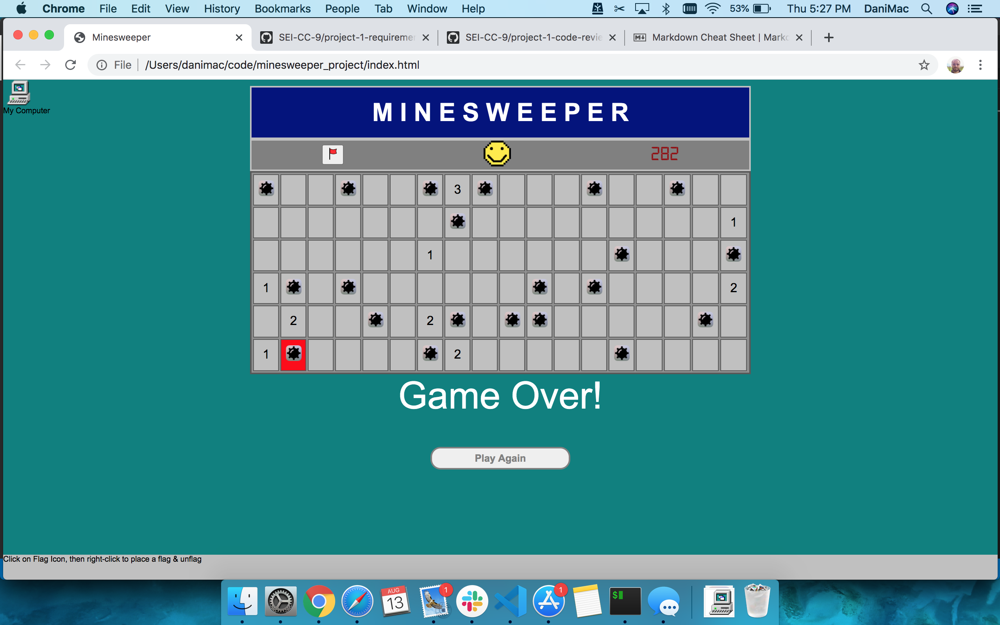

# Minesweeper Classic
## Marshal White
##### with HTML, CSS, & Javascript

Minesweeper is a puzzle video game, of which the earliest ancestors date back to the 1960s and 1970s.  The popular Microsoft version was developed by Curt Johnson and was released as part of the Microsoft Entertainment Pack 1 in 1990 before being included in the standard install of Windows 3.1 in 1992.[^1]

[Marshal's Minesweeper on Github Pages](https://mhwhite22.github.io/minesweeper_project/)

Technologies Used: HTML, CSS, & Javascript

##### Getting Started

The game begins with a rectangular board of blank or 'covered' squares.  Upon pressing start, the clock will begin to tick.  The player must click on squares, and if the square does not contain a mine, the square will contain a number which represents the number of mines in the 8 cells adjacent to or diagonal to the uncovered square.  If there are no mines in the nearby cells, the square will change colors.  If a player clicks on a square containing a mine, the game is over.  The player may place a flag on a square that holds a suspected mine by clicking the flag icon in the bar above the playing board and then right-clicking on the square.  

##### Next Steps

For my next steps, I would like to program a function that automatically uncovers the adjacent squares that are 0's if you click on a zero.  I'd also like to provide functionality to remove flag images from squares once they've been placed.  Beyond that, I'd like to provide for dynamic creation of the table that holds the playing board, with a couple of different difficulty settings, and to complete my styling to match the windows 95 version that I remember from my childhood.

[^1]: Source: https://en.wikipedia.org/wiki/Microsoft_Minesweeper

/*   Pseudocode from Planning on 8/6/20
Minesweeper Project
Marshal White

0. The game begins with a rectangular board of blank or 'covered' squares.

1.0 To begin the game, render the board
  1.1 Randomly generate locations of mines on X percentage of board squares.
  1.2 Create a nested array of numbers for rows/squares of the board.  If one or more mines are located in an adjacent square, the number will reflect the number of adjacent mines.

2.0 Handling Square Clicks
  2.1 If a square has a number, uncover it.
  2.2 if a square holds a mine, game over.
  2.3 May try to create a condition where the first click is always safe.

3.0 Flagging
  3.1 A player may right click on a square to place a flag (or change to a third color) if they believe the square contains a mine.

4.0 Win condition: no remaining uncovered squares which do not hold a mine.

5.0 Game over - if a player clicks on a mine, all mines uncover.  Game over message.

6.0 Timer - counting timer displayed above board.

7.0 Replay Button - reset board.